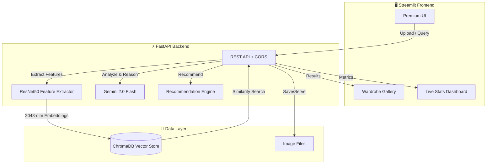

# 🌿 EcoStyle AI — Sustainable Fashion Intelligence

<div align="center">


**An AI-powered wardrobe management system that promotes sustainable fashion through intelligent recommendations, visual similarity detection, and personalized styling.**

[Features](#-features) · [Tech Stack](#-tech-stack) · [Architecture](#-architecture) · [Quick Start](#-quick-start) · [API Docs](#-api-reference)

</div>

---

## 🎯 The Problem

The fashion industry is the **2nd largest polluter** globally:

- 🗑️ 92 million tons of textile waste produced annually
- 💧 2,700 liters of water to make ONE cotton t-shirt
- 💰 Average person only wears 20% of their wardrobe regularly

**EcoStyle AI** combats this by making your existing wardrobe smarter, not bigger.

---

## ✨ Features

### 📸 AI Wardrobe Digitization

Upload photos of your clothes → **Gemini Vision AI** auto-classifies them by type, color, pattern, fabric, style, and season. ResNet50 generates visual embeddings for similarity search.

### 🧬 AI Personal Stylist (NEW)

Upload your own photo → AI analyzes your **skin tone, face shape, and hair color**. It then serves as your personal stylist, recommending outfits that specifically compliment your physical features (e.g., "This emerald green top highlights your auburn hair").

### 🛍️ Smart Shopping Advisor

Before buying something new, snap a photo → AI checks your existing wardrobe for duplicates using **cosine similarity on visual embeddings**. Prevents redundant purchases and reduces waste.

### 👗 AI Outfit Generator

Tell it the occasion and weather → AI curates a complete outfit from YOUR wardrobe, considering your style preferences, age, and gender expression.

### ✈️ Capsule Trip Packer

Planning a trip? AI creates a **minimal capsule wardrobe** packing list with day-by-day outfit plans and **chain-of-thought reasoning** for every styling decision. Powered by **real weather data** from Open-Meteo API.

### ♻️ Donation Detective

AI scans your wardrobe against your stated style and identifies items that no longer fit your aesthetic — perfect candidates for donation to extend their lifecycle.

### 📊 Sustainability Dashboard

Real-time tracking of your eco-impact: CO₂ saved by reusing items, wardrobe versatility score, and personalized sustainability tips.

---

## 🏗️ Tech Stack

| Layer | Technology | Purpose |
|-------|-----------|---------|
| **Frontend** | Streamlit | Premium glassmorphism UI |
| **Backend API** | FastAPI | RESTful endpoints |
| **Vision AI** | ResNet50 (PyTorch) | 2048-dim visual feature extraction |
| **LLM** | Google Gemini 2.0 Flash | Image analysis, reasoning, styling |
| **Vector DB** | ChromaDB | Cosine similarity wardrobe search |
| **Weather** | Open-Meteo API | Real-time forecasts (free, no key) |
| **Image Storage** | Local filesystem | Persistent wardrobe gallery |

---

## 🔄 Architecture



---

## 🚀 Quick Start

### Prerequisites

- Python 3.10+
- [Google Gemini API Key](https://aistudio.google.com/app/apikey)

### 1. Clone & Setup

```bash
git clone https://github.com/yourusername/ecostyle-ai.git
cd ecostyle-ai

# Create virtual environment
python -m venv venv
source venv/bin/activate  # or `venv\Scripts\activate` on Windows

# Install dependencies
pip install -r requirements.txt
```

### 2. Configure Environment

```bash
cp .env.example .env
# Edit .env and add your Gemini API key
```

### 3. Start the Backend

```bash
cd backend
uvicorn main:app --reload --port 8000
```

### 4. Start the Frontend (new terminal)

```bash
cd frontend
streamlit run app.py --server.port 8501
```

### 5. Open in Browser

Navigate to **<http://localhost:8501>** — you're ready to go! 🎉

---

### 🐳 Docker (Alternative)

```bash
docker-compose up --build
```

Backend: `http://localhost:8000` · Frontend: `http://localhost:8501`

---

## 📡 API Reference

| Method | Endpoint | Description |
|--------|----------|-------------|
| `GET` | `/` | Health check |
| `POST` | `/upload` | Upload & auto-tag a clothing item |
| `GET` | `/wardrobe` | Get all wardrobe items with images |
| `DELETE` | `/wardrobe/{id}` | Remove a wardrobe item |
| `GET` | `/stats` | Wardrobe statistics |
| `GET` | `/sustainability` | AI sustainability score |
| `POST` | `/analyze_purchase` | Shopping duplicate detector |
| `POST` | `/recommend` | AI outfit recommendation |
| `POST` | `/plan_trip` | Capsule wardrobe trip planner |
| `POST` | `/detect_donations` | Donation candidate finder |
| `GET` | `/weather` | Real-time weather forecast |

Full interactive docs available at `http://localhost:8000/docs` (Swagger UI).

---

## 🌍 Sustainability Impact

Every item you digitize instead of buying new:

- 🌱 **Saves ~8.2 kg of CO₂** emissions
- 💧 **Conserves ~2,700 liters** of water
- 🗑️ **Prevents ~0.5 kg** of textile waste

---

## 🧪 Testing

```bash
cd backend
python -m pytest tests/ -v
```

---

## 📄 License

MIT License — see [LICENSE](LICENSE) for details.

---

<div align="center">
<b>Built with 💚 for a more sustainable future</b>
</div>
